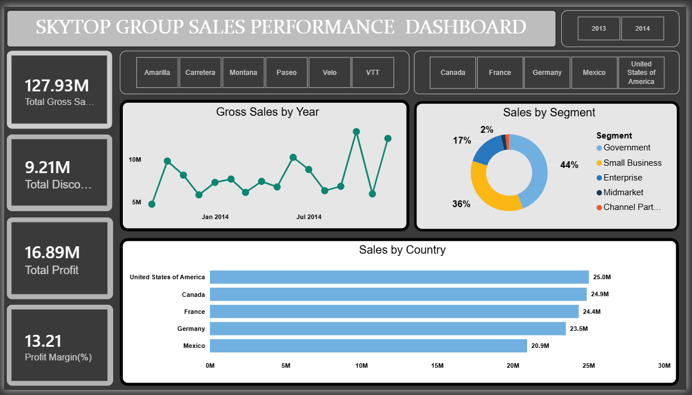

# SKYTOP GROUP Sales Performance Dashboard

## Overview

The **SKYTOP GROUP Sales Performance Dashboard** is an interactive Power BI project designed to analyze sales, profitability, discounts, products, countries, customer segments, and performance over time.

The dashboard transforms financial sales data into interactive business intelligence that can be used to understand overall performance, identify high-performing products and markets, evaluate profitability, and highlight areas that may require further investigation.

The underlying dataset contains **700 sales records** covering **2013 and 2014**, with information across five countries, six products, and five customer segments.

---

## Dashboard Preview



---

## Business Objective

The primary objective of this project is to provide a clear overview of SKYTOP GROUP's sales and financial performance while allowing users to explore performance across different business dimensions.

The dashboard was designed to help answer questions such as:

- How much sales revenue was generated?
- How much profit was generated?
- What is the overall profit margin?
- Which products generate the most revenue and profit?
- Which countries contribute the most to sales?
- Which customer segments are most profitable?
- How does sales performance change over time?
- How significant are discounts relative to gross sales?
- Which areas of the business may require further investigation?

---

## Key Performance Indicators

The dashboard tracks five major performance indicators:

| KPI | Description |
|---|---|
| Total Sales | Total sales revenue after discounts |
| Total Gross Sales | Revenue before discounts |
| Total Discounts | Total value of discounts applied |
| Total Profit | Profit generated after cost of goods sold |
| Profit Margin | Profit as a percentage of total sales |

---

## Key Results

Based on the underlying financial dataset, the business generated:

| Metric | Result |
|---|---:|
| Total Sales | **$118.73M** |
| Total Gross Sales | **$127.93M** |
| Total Discounts | **$9.21M** |
| Total Profit | **$16.89M** |
| Overall Profit Margin | **14.23%** |
| Units Sold | **1.13M** |
| Sales Records | **700** |

The figures provide a high-level view of the company's overall financial performance across the period covered by the dataset.

---

## Key Insights

### 1. Product Performance

**Paseo** was the strongest product by total sales, generating approximately **$33.01M** in sales.

It also generated the highest total profit at approximately **$4.80M**.

However, the product with the highest profit margin was **Amarilla**, with a margin of approximately **15.86%**.

This distinction is important because the product generating the most revenue is not necessarily the product with the highest profitability relative to sales.

| Product | Sales | Profit | Profit Margin |
|---|---:|---:|---:|
| Paseo | $33.01M | $4.80M | 14.53% |
| VTT | $20.51M | $3.03M | 14.79% |
| Velo | $18.25M | $2.31M | 12.64% |
| Amarilla | $17.75M | $2.81M | **15.86%** |
| Montana | $15.39M | $2.11M | 13.74% |
| Carretera | $13.82M | $1.83M | 13.22% |

---

### 2. Country Performance

The **United States** generated the highest sales at approximately **$25.03M**, followed closely by Canada at approximately **$24.89M**.

However, France and Germany achieved higher profit margins than the United States.

Germany recorded a profit margin of approximately **15.66%**, while France recorded approximately **15.53%**.

This demonstrates why sales revenue alone should not be used to evaluate market performance. A country can generate high revenue while operating at a comparatively lower margin.

| Country | Sales | Profit | Profit Margin |
|---|---:|---:|---:|
| United States of America | $25.03M | $3.00M | 11.97% |
| Canada | $24.89M | $3.53M | 14.18% |
| France | $24.35M | $3.78M | **15.53%** |
| Germany | $23.51M | $3.68M | **15.66%** |
| Mexico | $20.95M | $2.91M | 13.88% |

---

### 3. Segment Performance

The **Government** segment generated the highest sales at approximately **$52.50M** and the highest total profit at approximately **$11.39M**.

The **Enterprise** segment presents a more concerning result. Although it generated approximately **$19.61M** in sales, it recorded a loss of approximately **$0.61M**, resulting in a negative profit margin of approximately **-3.13%**.

The **Channel Partners** segment recorded the highest profit margin at approximately **73.13%**, although its total sales were much smaller than the Government and Small Business segments.

| Segment | Sales | Profit | Profit Margin |
|---|---:|---:|---:|
| Government | $52.50M | $11.39M | 21.69% |
| Small Business | $42.43M | $4.14M | 9.77% |
| Enterprise | $19.61M | -$0.61M | **-3.13%** |
| Midmarket | $2.38M | $0.66M | 27.71% |
| Channel Partners | $1.80M | $1.32M | **73.13%** |

The segment analysis highlights an important business intelligence principle: **high sales volume does not automatically translate into high profitability**.

---

### 4. Yearly Performance

Sales increased substantially between 2013 and 2014.

| Year | Sales |
|---|---:|
| 2013 | $26.42M |
| 2014 | $92.31M |

2014 generated approximately **78% of total sales** across the two-year period.

The substantial difference between the two years makes year-over-year analysis an important area for further investigation.

---

### 5. Monthly Performance

Sales varied considerably across the months in the dataset.

The strongest month was **October**, with approximately **$21.67M** in sales.

December was the second-highest month at approximately **$17.37M**.

The lowest monthly sales were recorded in **March**, at approximately **$5.59M**.

This variation suggests that there may be meaningful seasonal or business-cycle patterns worth investigating further.

---

## Dashboard Features

The Power BI dashboard provides interactive analysis through:

### KPI Cards

- Total Sales
- Total Gross Sales
- Total Discounts
- Total Profit
- Profit Margin

### Interactive Filters

Users can filter the analysis by:

- Product
- Year
- Country

### Visualizations

The report includes:

- Gross Sales over time
- Sales by Country
- Sales by Segment
- Product performance
- Financial KPI cards
- Interactive slicers for deeper analysis

These features allow users to move from a high-level business overview into more detailed performance analysis.

---

## Business Recommendations

### 1. Investigate the Enterprise Segment

The Enterprise segment generated significant sales but recorded a negative profit.

This should be a priority area for management investigation.

Possible areas to examine include:

- Pricing
- Discount levels
- Cost of goods sold
- Product mix
- Customer-specific pricing
- Contract structure

The objective should be to determine why substantial revenue is not translating into positive profitability.

---

### 2. Protect the Government Segment

The Government segment is the largest contributor to both sales and total profit.

Management should continue to support this segment while monitoring its long-term concentration within the overall business.

Maintaining strong customer relationships and understanding the factors driving its profitability could help preserve this important revenue source.

---

### 3. Evaluate the Effectiveness of Discounts

The dataset records approximately **$9.21M in discounts** against approximately **$127.93M in gross sales**.

Discounting can increase sales volume, but excessive discounting may reduce profitability.

A useful next step would be to compare:

- Discount levels
- Sales volume
- Revenue
- Profit
- Profit margin

This would help determine whether discounts are generating sufficient commercial value.

---

### 4. Build on Strong Product Performance

Paseo generated the highest total sales and total profit.

Management could investigate what is driving its performance, including:

- Sales volume
- Pricing
- Customer segment
- Country
- Discount levels
- Product demand

Understanding the drivers behind Paseo's performance could help identify opportunities to replicate successful strategies across other products.

---

### 5. Focus on Profitability, Not Revenue Alone

The analysis shows that the highest-sales products, countries, or segments are not always the most profitable.

For example:

- The United States generated the highest country-level sales but had a lower profit margin than France and Germany.
- Paseo generated the highest product sales, while Amarilla had the highest product profit margin.
- Government generated the highest segment sales and profit, while Enterprise generated substantial sales but a negative profit.

Therefore, future performance monitoring should consider **sales, profit, and profit margin together**.

---

### 6. Investigate the 2014 Sales Increase

The significant increase in sales between 2013 and 2014 warrants further investigation.

A deeper analysis could determine whether the increase was driven by:

- Higher unit volumes
- Product mix
- Geographic expansion
- Customer segment changes
- Pricing
- Discounting
- Seasonal factors

Understanding the cause of the increase would help determine whether the growth is sustainable.

---

## Data Preparation & Analysis Process

The project follows a standard business intelligence workflow:

```text
Financial Sales Data
        ↓
Data Preparation
        ↓
Data Modeling
        ↓
DAX Calculations
        ↓
Interactive Visualizations
        ↓
Performance Analysis
        ↓
Business Insights & Recommendations
```
---
The data was prepared and analyzed using Microsoft Power BI, with Microsoft Excel serving as the source dataset.

## Data Dictionary
The source dataset contains the following fields:
| Field               | Description                             |
| ------------------- | --------------------------------------- |
| Segment             | Customer or business segment            |
| Country             | Country associated with the transaction |
| Product             | Product sold                            |
| Discount Band       | Discount category applied               |
| Units Sold          | Number of units sold                    |
| Manufacturing Price | Manufacturing cost per unit             |
| Sale Price          | Selling price per unit                  |
| Gross Sales         | Sales before discounts                  |
| Discounts           | Discount amount                         |
| Sales               | Sales after discounts                   |
| COGS                | Cost of goods sold                      |
| Profit              | Profit generated from the transaction   |
| Date                | Transaction date                        |
| Month Number        | Numeric month                           |
| Month Name          | Month name                              |
| Year                | Year of transaction                     |
---

---
## Tools & Technologies
Power BI

Used for:
- Data modeling
- Data transformation
- DAX calculations
- KPI development
- Interactive filtering
- Data visualization
- Business intelligence reporting
---

---
Microsoft Excel
- Used as the source dataset for the financial analysis.
---

---
## Project Structure
powerbi-skytop-group-sales-performance/
│
├── README.md
│
├── PowerBI/
│   └── Skytop_Group_Sales_Performance.pbix
│
├── Data/
│   └── Financial_Data.xlsx
│
└── Screenshots/
    └── dashboard.png
---

---
## Limitations

This project is primarily a descriptive sales performance analysis.

The dataset provides useful information about sales, costs, discounts, products, countries, segments, and dates, but it does not contain enough information to establish causal relationships between business decisions and observed outcomes.

For example, the data can show that the Enterprise segment generated a negative profit, but it cannot independently explain why this occurred.

Therefore, the insights and recommendations should be treated as areas for management investigation rather than definitive causal conclusions.
---

---
## Potential Future Improvements

The project could be expanded by adding:

- Year-over-year growth calculations
- Sales growth percentage
- Profit growth percentage
- Discount-to-sales ratio
- Product profitability matrix
- Country profitability matrix
- Segment-level trend analysis
- Dynamic KPI comparisons
- Drill-through pages
- Tooltips with additional financial metrics
- Forecasting
- More detailed discount effectiveness analysis

These additions would provide greater analytical depth and support more advanced decision-making.
---

---
## Conclusion

The SKYTOP GROUP Sales Performance Dashboard provides an interactive view of the company's financial performance across products, countries, customer segments, and time.

The analysis shows strong overall sales and profitability, but also highlights important differences between revenue and profit performance.

Paseo leads in total sales and profit, while Amarilla achieves the strongest product-level margin. The United States generates the highest country sales, while Germany and France demonstrate stronger margins. The Government segment is the largest contributor to both sales and profit, whereas the Enterprise segment requires attention because of its negative profitability.

Overall, the project demonstrates how Power BI can transform raw financial data into an interactive analytical tool that supports performance monitoring, business questioning, and data-driven decision-making.
---

---
## Author
Priscilla Takyi
Data Analytics Portfolio
---

---
License

This project is intended for educational and portfolio purposes.
---
